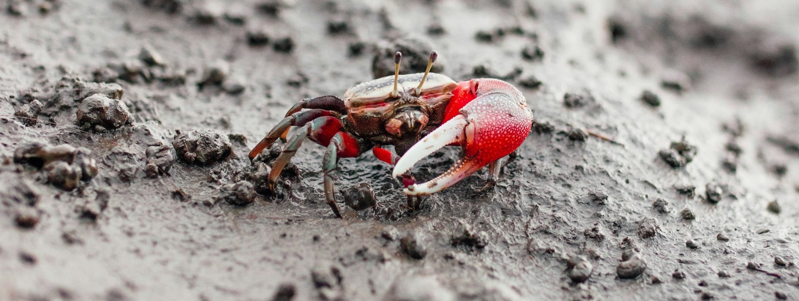

# Awesome Astrobiology 

_A curated[^curation_details] list of awesome resources on astrobiology[^definition_astrobiology]._

[^definition_astrobiology]: (from Wikipedia, see citation at the bottom) **Astrobiology** (also **xenology** or **exobiology**) is a scientific field within the [life](https://en.wikipedia.org/wiki/List_of_life_sciences "List of life sciences") and [environmental sciences](https://en.wikipedia.org/wiki/Environmental_science "Environmental science") that studies the [origins](https://en.wikipedia.org/wiki/Abiogenesis "Abiogenesis"), [early evolution](https://en.wikipedia.org/wiki/Protocell "Protocell"), distribution, and future of [life](https://en.wikipedia.org/wiki/Life "Life") in the [universe](https://en.wikipedia.org/wiki/Universe "Universe") by investigating its deterministic conditions and contingent events. [[2](https://en.wikipedia.org/wiki/Astrobiology#cite_note-about-2)] As a discipline, astrobiology is founded on the premise that life may exist beyond Earth. [[3](https://en.wikipedia.org/wiki/Astrobiology#cite_note-3)]. Research in astrobiology comprises three main areas: the study of [habitable environments](https://en.wikipedia.org/wiki/Planetary_habitability "Planetary habitability") in the [Solar System](https://en.wikipedia.org/wiki/Solar_System "Solar System") and beyond, the search for planetary [biosignatures](https://en.wikipedia.org/wiki/Biosignatures "Biosignatures") of past or present extraterrestrial life, and the study of the [origin](https://en.wikipedia.org/wiki/Abiogenesis "Abiogenesis") and [early evolution](https://en.wikipedia.org/wiki/Protocell "Protocell") of life on Earth. The field of astrobiology has its origins in the 20th century with the advent of [space exploration](https://en.wikipedia.org/wiki/Space_exploration "Space exploration") and the discovery of [exoplanets](https://en.wikipedia.org/wiki/Exoplanets "Exoplanets"). Early astrobiology research focused on the search for extraterrestrial life and the study of the potential for life to exist on other planets. [[2](https://en.wikipedia.org/wiki/Astrobiology#cite_note-about-2)] In the 1960s and 1970s, NASA began its astrobiology pursuits within the [Viking program](https://en.wikipedia.org/wiki/Viking_program "Viking program"), which was the first US mission to land on Mars and search for [signs of life](https://en.wikipedia.org/wiki/Viking_biological_experiments "Viking biological experiments"). [[4](https://en.wikipedia.org/wiki/Astrobiology#cite_note-4)] This mission, along with other early space exploration missions, laid the foundation for the development of astrobiology as a discipline. CITATION: Wikipedia contributors. "Astrobiology." Wikipedia. Last modified October 20, 2025. Accessed October 24, 2025. <https://en.wikipedia.org/wiki/Astrobiology>.

 [^image_attribution]

[^image_attribution]: Image used under the [Unsplash License](https://unsplash.com/license), i.e. "All images can be downloaded and used for free", "Commercial and non-commercial purposes", and "No permission needed (though attribution is appreciated!)". Image Link: <https://unsplash.com/photos/a-red-crab-crawling-in-the-sand-hapGkr3_-Lo>. Image Description: "a red crab crawling in the sand". Image Photographer: [Ryan Le](https://unsplash.com/@ryan_le).

[^curation_details]: This list follows specific scoping guidelines. The **Databases & Data Repositories** section includes NASA astrobiology databases and planetary science databases. **NASA Missions & Programs** covers current, upcoming, and past missions. **Organizations & Research Centers** features NASA centers and international astrobiology organizations. **Journals & Publications** includes primary and related journals. **Educational Resources** includes online courses, books, video content, and news sources. **Exoplanet Catalogs** lists dedicated exoplanet databases. **Tools & Software** covers observation planning, data analysis, and habitability calculators.

## Contents

- [Databases & Data Repositories](#databases--data-repositories)
- [NASA Missions & Programs](#nasa-missions--programs)
- [Organizations & Research Centers](#organizations--research-centers)
- [Journals & Publications](#journals--publications)
- [Educational Resources](#educational-resources)
- [Exoplanet Catalogs](#exoplanet-catalogs)
- [Tools & Software](#tools--software)
- [People](#people)
- [Related Awesome Lists](#related-awesome-lists)

## Databases & Data Repositories

### NASA Astrobiology Databases

1. [AHED (Astrobiology Habitable Environments Database)](https://ahed.nasa.gov): NASA's centralized open-source digital library for astrobiology research data with standardized ARMS metadata.
2. [NASA Life Detection Knowledge Base (LDKB)](https://science.nasa.gov/astrobiology/researchers/life-detection-resources/ldkb/): Community resource synthesizing biosignature information and detection strategies.
3. [NASA Astrobiology Program Data](https://science.nasa.gov/astrobiology/): Research publications, mission data, and program resources.

### Planetary Science Databases

1. [NASA Planetary Data System (PDS)](https://pds.nasa.gov): Archive of planetary mission data (images, spectra, derived products).
2. [Astromaterials Data System](https://www.lpi.usra.edu/adsearch/): Lunar samples, meteorites, cosmic dust catalog.

## NASA Missions & Programs

### Current & Upcoming Missions

1. [Mars 2020 Perseverance Rover](https://mars.nasa.gov/mars2020/): Astrobiology-focused rover collecting samples for potential return, searching for ancient microbial life.
2. [Europa Clipper](https://europa.nasa.gov): Mission to investigate Jupiter's moon Europa for subsurface ocean habitability (launch 2024, arrival 2030).
3. [Dragonfly](https://dragonfly.jhuapl.edu): Rotorcraft mission to Titan investigating prebiotic chemistry and habitability (launch 2027, arrival 2034).
4. [James Webb Space Telescope (JWST)](https://jwst.nasa.gov): Exoplanet atmosphere characterization for biosignatures.
5. [Nancy Grace Roman Space Telescope](https://roman.gsfc.nasa.gov): Direct imaging of exoplanets (launch 2027).

### Past Missions

1. [Viking 1 & 2](https://science.nasa.gov/mission/viking/): First life detection experiments on Mars (1976).
2. [Galileo](https://science.nasa.gov/mission/galileo/): Jupiter system exploration, discovered subsurface oceans on Europa.
3. [Cassini-Huygens](https://science.nasa.gov/mission/cassini/): Saturn system, found organic compounds on Enceladus and Titan.

## Organizations & Research Centers

### NASA Centers

1. [NASA Astrobiology Institute (NAI)](https://astrobiology.nasa.gov/nai/): Virtual distributed organization of competitively-selected research teams (established 1998).
2. [NASA Ames Astrobiology](https://www.nasa.gov/ames/astrobiology): Home to SETI Institute partnerships, AHED development.
3. [NASA Goddard Astrobiology Lab](https://science.gsfc.nasa.gov/astrobiology/): Laboratory and theoretical astrobiology research.
4. [JPL Center for Life Detection Science](https://www.jpl.nasa.gov/astrobiology): Mission technology development for biosignature detection.

### International Organizations

1. [European Astrobiology Institute (EAI)](https://www.eai-online.eu): Network of European researchers and institutions.
2. [European Astrobiology Network Association (EANA)](https://www.eana-net.eu): Professional society with annual conferences.
3. [Astrobiology Society of Britain (ASB)](https://www.asbiology.org.uk): UK learned society with researcher directory.
4. [AbGradE (Astrobiologists and Graduates in Europe)](https://www.abgrade.eu): Early-career network for PhD/postdoc opportunities.
5. [Centro de Astrobiologia (CAB) Spain](https://cab.inta-csic.es): Spanish astrobiology research center.

## Journals & Publications

### Primary Journals

1. [Astrobiology](https://www.liebertpub.com/journal/ast): Leading peer-reviewed journal (Mary Ann Liebert, Inc.).
2. [International Journal of Astrobiology](https://www.cambridge.org/core/journals/international-journal-of-astrobiology): Cambridge University Press.
3. [Nature Astrobiology Collection](https://www.nature.com/subjects/astrobiology): High-impact papers from Nature Publishing Group.

### Related Journals

1. [The Astrophysical Journal](https://iopscience.iop.org/journal/0004-637X): Exoplanet habitability and stellar astrophysics.
2. [The Planetary Science Journal](https://iopscience.iop.org/journal/2632-3338): Planetary habitability and biosignatures.
3. [Frontiers in Astronomy and Space Sciences - Astrobiology](https://www.frontiersin.org/journals/astronomy-and-space-sciences/sections/astrobiology): Open access section.
4. [Icarus](https://www.sciencedirect.com/journal/icarus): Planetary science including habitability studies.
5. [Origins of Life and Evolution of Biospheres](https://www.springer.com/journal/11084): Origins of life research.

## Educational Resources

### Online Courses

1. [Astrobiology: Exploring Other Worlds (Coursera/University of Arizona)](https://www.coursera.org/learn/astrobiology-exploring-other-worlds): Free online course by Prof. Chris Impey.
2. [Astrobiology and the Search for Extraterrestrial Life (edX/University of Edinburgh)](https://www.edx.org/course/astrobiology-and-the-search-for-extraterrestrial-life): Free course by Prof. Charles Cockell.
3. [NASA Astrobiology Primer](https://astrobiology.nasa.gov/uploads/filer_public/75/c5/75c5c5d5-5f9a-4f8e-8b1e-0e1e4f8e7c5a/astrobiology_primer_v2.pdf): Comprehensive educational document.

### Books

1. [Astrobiology: A Very Short Introduction](https://global.oup.com/academic/product/astrobiology-a-very-short-introduction-9780198722762): David C. Catling's concise overview (2013).
2. [Life in the Universe](https://www.pearson.com/us/higher-education/program/Bennett-Life-in-the-Universe-4th-Edition/PGM1882320.html): Jeffrey Bennett and Seth Shostak college-level textbook (4th edition).
3. [An Astrobiology Strategy for the Search for Life in the Universe](https://nap.nationalacademies.org/catalog/25252/an-astrobiology-strategy-for-the-search-for-life-in-the-universe): National Academies report (2019).

### Video Content

1. [NASA Astrobiology YouTube](https://www.youtube.com/nasaastrobiology): Podcasts, lectures, mission updates.
2. [TED Talks on Astrobiology](https://www.ted.com/topics/astrobiology): Popular science presentations.
3. [Ologies Podcast with Alie Ward - Astrobiology Episode](https://www.alieward.com/ologies/astrobiology): Interview with Dr. Kevin Peter Hand.

### News & Media

1. [NASA Astrobiology News](https://astrobiology.nasa.gov/news/): Latest research and mission updates.
2. [Astrobiology.com](https://astrobiology.com): Daily news summaries with links to original papers.
3. [Astrobiology Magazine](https://www.astrobio.net): Historical archive (inactive but searchable).

## Exoplanet Catalogs

1. [NASA Exoplanet Archive](https://exoplanetarchive.ipac.caltech.edu): Official NASA catalog with 5,000+ confirmed exoplanets (includes interactive tools, bulk data downloads).
2. [Open Exoplanet Catalogue](https://www.openexoplanetcatalogue.com): Decentralized, open-source catalogue (5,288 confirmed planets, XML format, GitHub integration).
3. [Exoplanet.eu](https://exoplanet.eu/catalog/): European database with sortable/filterable catalogue.
4. [PlanetS Exoplanet Catalog (DACE)](https://dace.unige.ch/exoplanets/): Curated catalog focused on transiting planets with reliable mass/radius measurements.
5. [Habitable Worlds Catalog (HWC)](https://phl.upr.edu/hwc): PHL @ UPR Arecibo catalog replacing the Habitable Exoplanets Catalog (2024).

## Tools & Software

### Observation Planning

1. [JWST Exposure Time Calculator](https://jwst.etc.stsci.edu): Plan exoplanet atmosphere observations.
2. [Exoplanet Transit Database](http://var2.astro.cz/ETD/): Predict transit times for follow-up observations.

### Data Analysis

1. [Exoplanet Package (Python)](https://docs.exoplanet.codes): Probabilistic models for exoplanet data.
2. [PyTransit](https://github.com/hpparvi/PyTransit): Fast exoplanet transit light curve modeling.
3. [BATMAN (Bad-Ass Transit Model cAlculatioN)](https://www.cfa.harvard.edu/~lkreidberg/batman/): Python package for transit modeling.

### Habitability Calculators

1. [Habitable Zone Calculator](http://depts.washington.edu/naivpl/content/hz-calculator): University of Washington tool for determining habitable zones.
2. [Planetary Spectrum Generator](https://psg.gsfc.nasa.gov): NASA tool simulating planetary spectra.

## People

- [Rory Barnes](https://github.com/RoryBarnes) - University of Washington. Lead developer of VPLanet, a virtual planet simulator for modeling planetary habitability.
- [Mike Lee (AstrobioMike)](https://github.com/AstrobioMike) - National Biodefense Analysis and Countermeasures Center. Developer of GToTree and open bioinformatics educational resources for astrobiologists.
- [Arkadiy Garber](https://github.com/Arkadiy-Garber) - Arizona State University. Developer of FeGenie for iron-related gene identification in microbial genomes relevant to geobiology.
- [Guadalupe Tovar Mendoza](https://github.com/lupitatovar) - Johns Hopkins University. Studies stellar magnetic activity on low-mass stars and its impact on exoplanet habitability.
- [Caitlin Casar](https://github.com/CaitlinCasar) - Northwestern University. Characterized microbial life in the Deep Mine Microbial Observatory, a Mars subsurface analog site.
- [Celia Blanco](https://celiablanco.github.io/) - Centro de Astrobiologia (CAB), Spain. Computational research on the emergence and evolution of complex biological systems.

## Related Awesome Lists

- [Awesome Space](https://github.com/orbitalindex/awesome-space) - Space-related packages and resources maintained by The Orbital Index.
- [Awesome Astronomy](https://github.com/jonathansick/awesome-astronomy) - Curated list of astronomy projects and resources.
- [Awesome Paleontology](https://github.com/O957/awesome-paleontology) - Paleontology resources covering the history of life on Earth.
- [Awesome Geology](https://github.com/O957/awesome-geology) - Geology resources with planetary geology overlap.

## Contributing

Notice anything missing that would be a good fit? If interested in contributing, please see the [contributing file](./CONTRIBUTING.md) for further direction.

## Code of Conduct

Please see the [code of conduct](./CODE_OF_CONDUCT.md).

## License

To the extent possible under law, [O957](https://github.com/O957) has waived all copyright and related or neighboring rights to this work.
