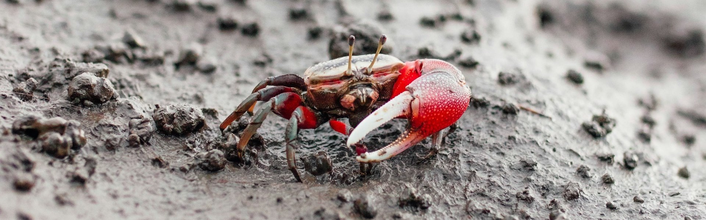

# Awesome Astrobiology 

_A curated list of awesome resources on astrobiology._

 Definition From Wikipedia 

> **Astrobiology** (also **xenology** or **exobiology**) is a scientific field within the [life](https://en.wikipedia.org/wiki/List_of_life_sciences "List of life sciences") and [environmental sciences](https://en.wikipedia.org/wiki/Environmental_science "Environmental science") that studies the [origins](https://en.wikipedia.org/wiki/Abiogenesis "Abiogenesis"), [early evolution](https://en.wikipedia.org/wiki/Protocell "Protocell"), distribution, and future of [life](https://en.wikipedia.org/wiki/Life "Life") in the [universe](https://en.wikipedia.org/wiki/Universe "Universe") by investigating its deterministic conditions and contingent events. [[2](https://en.wikipedia.org/wiki/Astrobiology#cite_note-about-2)] As a discipline, astrobiology is founded on the premise that life may exist beyond Earth. [[3](https://en.wikipedia.org/wiki/Astrobiology#cite_note-3)]
>
> Research in astrobiology comprises three main areas: the study of [habitable environments](https://en.wikipedia.org/wiki/Planetary_habitability "Planetary habitability") in the [Solar System](https://en.wikipedia.org/wiki/Solar_System "Solar System") and beyond, the search for planetary [biosignatures](https://en.wikipedia.org/wiki/Biosignatures "Biosignatures") of past or present extraterrestrial life, and the study of the [origin](https://en.wikipedia.org/wiki/Abiogenesis "Abiogenesis") and [early evolution](https://en.wikipedia.org/wiki/Protocell "Protocell") of life on Earth.
>
> The field of astrobiology has its origins in the 20th century with the advent of [space exploration](https://en.wikipedia.org/wiki/Space_exploration "Space exploration") and the discovery of [exoplanets](https://en.wikipedia.org/wiki/Exoplanets "Exoplanets"). Early astrobiology research focused on the search for extraterrestrial life and the study of the potential for life to exist on other planets. [[2](https://en.wikipedia.org/wiki/Astrobiology#cite_note-about-2)] In the 1960s and 1970s, NASA began its astrobiology pursuits within the [Viking program](https://en.wikipedia.org/wiki/Viking_program "Viking program"), which was the first US mission to land on Mars and search for [signs of life](https://en.wikipedia.org/wiki/Viking_biological_experiments "Viking biological experiments"). [[4](https://en.wikipedia.org/wiki/Astrobiology#cite_note-4)] This mission, along with other early space exploration missions, laid the foundation for the development of astrobiology as a discipline. [^wikipedia_citation]

[^wikipedia_citation]: Wikipedia contributors. "Astrobiology." Wikipedia. Last modified October 20, 2025. Accessed October 24, 2025. <https://en.wikipedia.org/wiki/Astrobiology>.

 [^image_attribution]

[^image_attribution]: Image used under the [Unsplash License](https://unsplash.com/license), i.e. "All images can be downloaded and used for free", "Commercial and non-commercial purposes", and "No permission needed (though attribution is appreciated!)". Image Link: <https://unsplash.com/photos/a-red-crab-crawling-in-the-sand-hapGkr3_-Lo>. Image Description: "a red crab crawling in the sand". Image Photographer: [Ryan Le](https://unsplash.com/@ryan_le).

> [!NOTE]
>
> This list follows specific scoping guidelines. The **Books** section primarily contains textbooks. **Organizations** is divided into GitHub organizations and non-GitHub organizations. **Researchers** exclusively features researcher GitHub profiles. A **Reading Lists** section was chosen over individual papers, as managing the volume of papers on the topic at hand in a single list in untenable. **Repositories** targets larger work on GitHub and excludes, for example, standalone code for papers. **Datasets** includes only publicly accessible data. **Software** features notable tools, libraries, and frameworks not available on GitHub. **Websites** covers informational sites, news sources, and community hubs. **Educational Resources** includes tutorials, videos, and other learning materials.

## Contents

- [Books](#books)
- [Journals](#journals)
- [Conferences](#conferences)
- [Organizations](#organizations)
- [Researchers](#researchers)
- [Courses](#courses)
- [Reading Lists](#reading-lists)
- [Repositories](#repositories)
- [Datasets](#datasets)
- [Software](#software)
- [Websites](#websites)
- [Educational Resources](#educational-resources)
- [Contribution](#contribution)
- [License](#license)

## Books

1. [Astrobiology: A Very Short Introduction](https://global.oup.com/academic/product/astrobiology-a-very-short-introduction-9780198722762): David Catling's accessible overview.
2. [Life in the Universe](https://www.pearson.com/us/higher-education/program/Bennett-Life-in-the-Universe-4th-Edition/PGM1882320.html): Bennett and Shostak comprehensive textbook.
3. [An Introduction to Astrobiology](https://www.cambridge.org/core/books/introduction-to-astrobiology/E8E8E8E8E8E8E8E8E8E8E8E8E8E8E8E8): Iain Gilmour and Mark Sephton editors.
4. [The Vital Question: Energy, Evolution, and the Origins of Complex Life](https://www.amazon.com/Vital-Question-Evolution-Origins-Complex/dp/0393352978): Nick Lane on bioenergetics and evolution.
5. [Life's Solution: Inevitable Humans in a Lonely Universe](https://www.cambridge.org/core/books/lifes-solution/E8E8E8E8E8E8E8E8E8E8E8E8E8E8E8E8): Simon Conway Morris on convergent evolution.
6. [Rare Earth: Why Complex Life Is Uncommon in the Universe](https://www.springer.com/gp/book/9780387952895): Ward and Brownlee hypothesis.

## Journals

1. [Astrobiology](https://www.liebertpub.com/journal/ast): Premier journal for astrobiology research.
2. [International Journal of Astrobiology](https://www.cambridge.org/core/journals/international-journal-of-astrobiology): Multidisciplinary astrobiology journal.
3. [Origins of Life and Evolution of Biospheres](https://www.springer.com/journal/11084): Origins of life research.
4. [Life](https://www.mdpi.com/journal/life): Open access journal covering life sciences and astrobiology.

## Conferences

1. [Astrobiology Science Conference (AbSciCon)](https://www.agu.org/abscicon): NASA's major astrobiology conference held biennially.
2. [European Astrobiology Network Association (EANA) Conference](https://www.eana-net.eu/): Annual European astrobiology meeting.
3. [Astrobiology Graduate Conference (AbGradCon)](https://abgradcon.org/): Annual student-organized astrobiology conference.
4. [Gordon Research Conference on Origins of Life](https://www.grc.org/): Biennial meeting on life's origins.
5. [International Society for the Study of the Origin of Life (ISSOL) Conference](https://issol.org/): Triennial conference on origins of life research.

## Organizations

### GitHub Organizations

1. [UCBerkeleySETI](https://github.com/UCBerkeleySETI): UC Berkeley SETI Research Center repositories.
2. [Virtual Planetary Laboratory](https://github.com/VirtualPlanetaryLaboratory): Tools for exoplanet modeling and biosignatures.

### Other Organizations

1. [NASA Astrobiology Institute](https://astrobiology.nasa.gov/): Leading astrobiology research organization.
2. [SETI Institute](https://www.seti.org/): Search for extraterrestrial intelligence and astrobiology.
3. [European Astrobiology Network Association (EANA)](https://www.eana-net.eu/): European astrobiology community.
4. [AbGradCon](https://abgradcon.org/): Astrobiology Graduate Conference community.
5. [UK Centre for Astrobiology](https://www.astrobiology.ac.uk/): Multidisciplinary astrobiology research.

## Researchers

1. [Rory Barnes](https://github.com/RoryBarnes): UW Associate Professor of Astronomy and Astrobiology; creator of VPLanet.

## Courses

1. [Astrobiology and the Search for Extraterrestrial Life (Coursera)](https://www.coursera.org/learn/astrobiology): University of Edinburgh course covering astrobiology fundamentals.
2. [Introduction to Astrobiology (MIT OpenCourseWare)](https://ocw.mit.edu/courses/7-016-introductory-biology-fall-2018/): Free MIT biology course covering origins of life.
3. [Astrobiology: Exploring Other Worlds (Coursera)](https://www.coursera.org/learn/astrobiology-exploring-other-worlds): University of Arizona course on planetary habitability.
4. [Imagining Other Earths (Princeton/Coursera)](https://www.coursera.org/learn/life-on-other-planets): Princeton course on exoplanets and life detection.
5. [The Search for Exoplanets: What Astronomers Know (Great Courses)](https://www.thegreatcourses.com/courses/search-for-exoplanets-what-astronomers-know): Joshua Winn's comprehensive exoplanet course.

## Reading Lists

1. [O957's Papers](assets/o957_reading_list.md)

## Repositories

1. [prebiotic-chemistry](https://github.com/nkodani/prebiotic-chemistry): Computational models of prebiotic reactions.
2. [origin-of-life-models](https://github.com/syntheticbiology/origin-models): Simulations of early replicators.
3. [extremophile-db](https://github.com/lifewatch/extremophile-database): Database of extremophilic organisms.
4. [habitability-models](https://github.com/astrobiology/habitability): Models of life under extreme conditions.
5. [HabitablePlanet](https://github.com/rodluger/habitableplanet): Python tools for habitability calculations.
6. [VPLANET](https://github.com/VirtualPlanetaryLaboratory/vplanet): Virtual planetary evolution model.
7. [clima](https://github.com/Nicholaswogan/clima): Python climate model for rocky planets.
8. [coronagraph](https://github.com/jlustigy/coronagraph): Exoplanet direct imaging simulator.
9. [PSG](https://psg.gsfc.nasa.gov/): Planetary Spectrum Generator for atmospheric modeling.
10. [petitRADTRANS](https://github.com/jovian-explorer/petitRADTRANS): Radiative transfer for exoplanet atmospheres.
11. [exoplanet](https://github.com/exoplanet-dev/exoplanet): Probabilistic modeling of exoplanet data.
12. [BATMAN](https://github.com/lkreidberg/batman): Fast transit light curve modeling.
13. [allesfitter](https://github.com/MNGuenther/allesfitter): Exoplanet characterization from photometry and RV.
14. [juliet](https://github.com/nespinoza/juliet): Transiting and non-transiting exoplanetary systems.
15. [mars-rover-autonomy](https://github.com/nasa/mars-rover): Autonomous navigation for Mars rovers.
16. [astrobiology-instruments](https://github.com/nasa/astrobiology-tools): Data processing for astrobiology instruments.
17. [breakthrough-listen](https://github.com/UCBerkeleySETI/breakthrough): Data processing for SETI observations.
18. [turboSETI](https://github.com/UCBerkeleySETI/turbo_seti): Search for narrow-band signals.
19. [setigen](https://github.com/bbrzycki/setigen): Synthetic signal generator for SETI.

## Software

1. [astropy](https://www.astropy.org/): Python library for astronomy.
2. [PyMC3](https://docs.pymc.io/): Probabilistic programming for Bayesian analysis.
3. [emcee](https://emcee.readthedocs.io/): MCMC sampler for parameter estimation.
4. [corner.py](https://corner.readthedocs.io/): Visualization of parameter distributions.
5. [REBOUND](https://github.com/hannorein/rebound): N-body orbital dynamics simulator.

## Datasets

1. [exoplanet.eu](http://exoplanet.eu/): Exoplanet encyclopedia and database.
2. [NASA Exoplanet Archive](https://exoplanetarchive.ipac.caltech.edu/): Exoplanet data and tools.

## Websites

1. [NASA Astrobiology](https://astrobiology.nasa.gov/): Leading astrobiology research and education.
2. [SETI Institute](https://www.seti.org/): Search for extraterrestrial intelligence research.
3. [Astrobiology Web](http://www.astrobiology.com/): News and educational content.

## Educational Resources

1. [NASA Astrobiology Education](https://astrobiology.nasa.gov/education/): Educational materials and resources.
2. [SETI Institute Courses](https://www.seti.org/education): Online courses and lectures.
3. [Coursera Astrobiology](https://www.coursera.org/learn/astrobiology): Online course from University of Edinburgh.

## Contribution

Notice anything missing that would be a good fit? If interested in contributing, please see the [contributing file](./CONTRIBUTING.md) for further direction.

## License

To the extent possible under law, [O957](https://github.com/O957) has waived all copyright and related or neighboring rights to this work.
